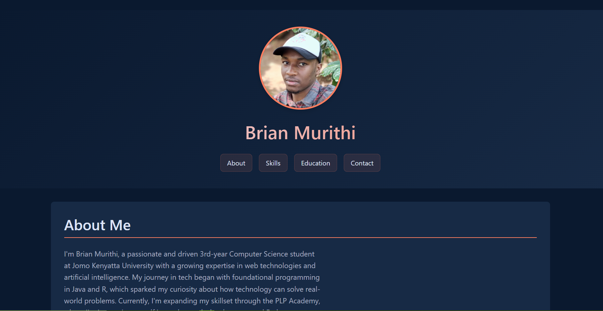

# Brian Murithi - Portfolio

  
**Live Demo:** [brianmurithi.netlify.app](https://brianmurithi.netlify.app/)

## 📌 Overview
A responsive portfolio website showcasing my skills, projects, and professional background as a Computer Science student specializing in web development and AI.

## ✨ Features
- **Modern Design**: Clean, accessible layout with semantic HTML5
- **Responsive**: Works on all devices (mobile, tablet, desktop)
- **Interactive Elements**:
  - Contact form
  - Downloadable CV
  - Project showcase
- **Performance Optimized**: Fast loading static site

## 🛠 Technologies Used
- **Frontend**: HTML5, CSS3
- **Hosting**: [Netlify](https://www.netlify.com) (with free SSL)
- **Version Control**: Git & GitHub

## 📂 Project Structure
```
portfolio/
├── index.html          # Main website file
├── style.css           # Stylesheet
├── assets/             # Contains all media
|   ├── Brian-Mutegi-Cv.pdf   # Pdf CV
│   ├── Brian-Mutegi-Cv.docx  # Word CV      
│   ├── Brianm.webp     # Profile photo
│   ├── portfolio.png   # Project screenshot
│   ├── cv.jpg          # CV preview
│   ├── jkuatlogo.png   # University logo
│   └── PLP.png         # Academy logo
├── README.md           # This file
└── LICENSE
```

## 🚀 Deployment
Deployed automatically via Netlify:
1. Connected GitHub repository
2. Automatic builds on `git push`
3. Custom domain setup

## 🔍 Accessibility
- Semantic HTML5
- ARIA labels
- Keyboard navigable
- Color contrast optimized

## 📬 Contact
- **Email**: [brianmurithi27@gmail.com](mailto:brianmurithi27@gmail.com)
- **GitHub**: [github.com/Yobrii](https://github.com/Yobrii)
- **Phone**: [+254 115 616 990](tel:+254115616990)

## 📜 License
MIT License - See [LICENSE](LICENSE) file (coming soon)

---

💡 **Tip**: The contact form submits via email using the `mailto:` protocol. Consider integrating Netlify Forms for better functionality.

Last Updated: August 2025